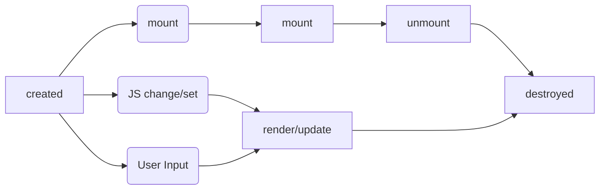

组件化：怎么样去扩展HTML标签，引申出来的一个前端架构体系，它主要的目标是复用
架构模式：MVC、MVVM，主要是前端跟数据逻辑层之间是如何去交互的
## （一）组件的基本知识
### 一、组件的基本概念和基本组成部分     

组件会区别于模块、区别于对象，组件是跟UI强相关的一种东西，可以认为它是一种特殊的模块、或者是特殊的对象、它既是对象又是模块，它的特点是以树形结构来进行组合、并且它有一种模板化的配置的能力。    

组件和对象之间的区别：    
对象：（三要素）
* Properties 属性
* Methods 方法
* Inherit 继承关系

组件：（要素）
* Properties
* Methods
* Inherit
* Attribute
* Config & State  配置 & 状态
* Event 事件机制，组件往外传递东西
* Liftcycle 生命周期
* Children 树形结构

**Attribute vs Property**
* Attribute 强调描述性
比如说这个人头发是黄色的，表示强调
* Property 强调从属关系
比如说哦一个对象，它有一个property是另一个对象，那么大概率这两个对象是存在一个从属关系的，即子对象从属于父对象，它是它的一部分，这样就称为Property。   
有一些特殊情况，比如说它是一个弱引用，它引了一个另外的对象。   

在实际使用过程中，property是面向对象的这样一个property这样的一个概念，attribute最初的使用就是XML里面的attribute这样的一个概念，它们两个有些时候是比较相似的，有些时候又是不同的。    

HTML里面设计的例子：     
HTML就是一个典型的 property和attribute两者不等效的这样的一个系统。
```html
Attribute:
<my-component attribute="v" />
myComponent.getAttribute("a")
myComponent.setAttribute("a", "value");

Property:
myComponent.a = "value";
```
解释：HTML里面的Attribute是可以通过HTML代码去设置的，HTML的attribute它也是可以用JavaScript代码去设置的，比如说 myComponent.getAttribute("a"); 取出来的就是 attribute，setAttribute("a","value")它设置的就是 attribute，它跟 property 不一样。    

在HTML里写 myComponent.a = "value"; 就表示 Property。    

eg1:    
```html
<div class="cls1 cls2"></div>
<script>
var div = document.getElementByTagName('div');
div.className //cls1 cls2
</script>
```
早期的JavaScript里Class是关键字，早期的JavaScript是不允许关键字做属性名的，现在是关键字可以做属性名，但是为了规避这个问题，HTML里面就做了一个妥协的设计，他把attribute仍然叫做class，但是Property变成了className，两者之间是完全的互相反射关系。   
div.class是可以的，但是HTML里还是不支持class这个关键字的。

eg2：
```html
<div class="cls1 cls2" style="color:blue"></div>
<script>
var div = document.getElementByTagName('div');
div.style // 对象
</script>
```
解释：attribute它是一个字符串，而这个property它是一个字符串语义化之后的对象，最典型就是一个style，style属性，在HTML里面attribute style 也是个字符串，如果用getAttribute和setAttribute也可以去设置attribute，但是如果说用style属性，你就可以得到一个 key value 的这样一个结构。一般因为 key value 结构，它的语义化得更好用，所以一般都能得到 div 的style。一般都主要用 property。    

eg3：   
```html
<a href="//m.taobao.com"></div>
<script>
var a = document.getElementByTagName('a');
a.href    // “http://m.taobao.com”， 这个URL是resolve过的结果   
a.getAttribute('href')  // “//m.taobao.com”， 跟HTML代码中完全一致
</script>
```
property 是经过resolve过的URL，“//m.taobao.com”，http或者https协议是根据当前页面做的。   
没有resolve过的，写啥是啥的就是 attribute。    
在代码里同时可以访问到property和attribute，但是它俩不是一回事，它们两个也会互相地更改。比如说你改了attribute、property也跟着变。    
eg4：   
```html
<input value="cute" />
<script>
var input = document.getElementByTagName('input'); //若property没有设置，则结果是attribute
input.value  // cute
input.getAttribute('value'); //cute
input.value = 'hello';  // 若value属性已经设置，则attribute不变，property变化，元素上实际的效果是property优先   
input.value  //hello
input.getAttribute('value');  //cute
</script>
```
解释：attribute相当于是一个value的默认值，不论是由用户去修改，用户在input里边输入了什么东西，还是因为程序的代码里面给property赋值过，它的attribute不会跟着变的，它的显示上会优先显示property，attribute实际上相当于一个默认值一样的东西   

如何设计组件状态
|  表头     | Markup set | JS set | JS Change | User Input Change |
|  :----:   | :----:     | :----: | :----:    | :----:            |
| property  | ×          | √      |  √        |  ？               |
| attribute | √          | √      |  √        |  ？               |
| state     | ×          | ×      |  ×        |  √                |
| config    | ×          | √      |  ×        |  ×                |

Markup set（标签设置）、JS set（JS代码设置）、JS Change（JS代码改变）、User Input Change（终端用户的输入去改变）        
**property**：是不能被标签这种静态的声明语言去设置的；它可以被JS设置；也可以被JS改变；用户输入是否会改变property，大部分情况下，property是不应该由用户去改变的，少数情况下，它可能来自于你的业务逻辑，那么它有可能会接受用户输入的改变。    
**attribute**：是由markup设置、JS设置、JS去改变都是可以的，用户的输入不一定会改变它，跟property类似。大部分情况下，也是不会去改变attribute。        
**state**：它有一个很大的特点就是说，它只能从组件的内部去改变，它不会从组件的外部去改变。如果想要设计一个东西，是从组件外部去改变组件，我是写组件的人，你是用组件的人，你想去改变我的state，一般来说我不会给你提供这种能力，这样的话，我的state就失控了，state一致性保证不了。但是作为组件的设计者要保证用户输入是能够改我的state，比如说用户点了一个tab，那么哪个tab被激活了，这个时候一般是通过state去控制。    
**config**：config是一个一次性的结果，它只有在我组件构造的时候会触发，那么它能够一次性的被传进来，它是不可更改的，这是它跟以上几个最大的区别。    
因为config的不可更改性，通常会把它留给全局。     

**组件的生命周期** 
任何一个组件的生命周期：    


一个组件被创建了之后，它有没有被显示出来，放在屏幕的树上，这个就是mount，mount和unmount是会反复发生的，unmount之后是可以回到created这样的状态的。

组件在什么时候会更改状态：（update）
（1）组件的使用者通过代码去更改组件
（2）组件的终端用户，用户输入、点击、tab切换的时候，它会产生一个组件的生命周期

**Children**
Content型 Children 与 Template型 Children
```html
<my-button>{{title}}</my-button>

<my-list>
    <li>{{title}}</li>
</my-list>
```
Children是构建组件树的一个最重要的一个组件的特性，它有两种类型的Children。
* 一种是Content型的Children，即有几个Children就显示出来几个Children，这种情况下设计 Children的时候，他这个组件树是非常简单的，有就有，没有就没有；
* 还有一种是 Template型的Children，这种时候整个的Children充当了一个模板的作用。    
比如设计一个list，它可能有list这样的结构，但是它的Children并不能够反映它实际最后显示出来的组件的数目，一般来说list是要接收data的，那么它就是由这个数据来产生的，如果有100个数据，那么它就有100个实际的Children，这个模板会被复制100份，这个就是Template型的Children。   

所以在设计组件树的Children的时候，一定要考虑到这两种不同的场景。   
* React虽然没有Template型的Children，但是它的Children可以传函数，传函数可以 return 一个 Children，这个时候就充当了一个模板型Children的作用。   
* Vue里边，做无尽的滚动列表的时候，对Vue去做这种模板型Children，是有一定的要求的。

### 二、为组件添加JSX语法
JSX一般来说是属于React的一个部分，facebook在早期会把JSX定义成一种纯粹的语言扩展，它也是可以被其他的组件体系去使用的，甚至可以把它单纯地作为一种创建HTML的标签的快捷方式去使用。   
**配置JSX环境的步骤：**   
* 新建一个文件夹 jsx
* 进入jsx文件夹：npm init
* 安装webpack：npm install -g webpack webpack-cli
* 查看webpack是否安装成功：webpack --version
* 安装babel（安装到了全局）：JSX是babel的一个插件，所以需要依次安装 webpack、babel-loader、babel、babel的plugin，一共有4个大的步骤。
    * webpack可以帮我们把一个普通的JavaScript的文件变成一个，可以把不同的import、require这些东西给它打包到一起去。
    * babel可以把一个新版本的JS编译成一个老版本的JS，这样老版本的JS就可以在更多的老版本的浏览器环境里面去跑了。
* 安装babel-loader（安装到本地目录）：npm install --save-dev webpack babel-loader
* 进入到jsx文件夹内查看package.json，即可看见 devDependencies 里边有了 "babel-loader" 和 "webpack"   
* 创建 webpack.config.js 文件
```javascript
module.exports = {
    entry:'./main.js'
}
```
* 创建 main.js文件（与webpack.config.js为同一个目录）
```javascript
for(let i of [1, 2, 3]){
    console.log('打印', i);
}
```
* 执行命令：webpack，即可出现 dist 文件夹
* 安装babel：npm install --save-dev @babel/core @babel/preset-env
在webpack.config.js
```javascript
module.exports = {
    entry:'./main.js',
    module:{
        rules:[
            {
                test:/\.js$/,
                use:{
                    loader:"babel-loader",
                    options:{
                        presets: ['@babel/preset-env'],                                  
                    }
                }
            }
        ]
    }
}
```
* 编译，执行命令 webpack
* 配置 mode:development 模式
```javascript
module.exports = {
    entry:'./main.js',
    module:{
        rules:[
            {
                test:/\.js$/,
                use:{
                    loader:"babel-loader",
                    options:{
                        presets: ['@babel/preset-env'],                                  
                    }
                }
            }
        ]
    },
    mode: "development"
}
```
* 执行webpack编译
* 安装允许JSX的包 `@babel/plugin-transform-react-jsx`：npm install --save-dev @babel/plugin-transform-react-jsx
* 在webpack.config.js中配置JSX

运行：

main.js中
```javascript
function createElement(){
    return ;
}
let a = <div id="a">
    <span></span>
    <span></span>
    <span></span>
</div>
```
编译后，执行的实际上就是
```javascript
var a = createElement("div", {
    id: "a"
  }, 
  createElement("span", null), 
  createElement("span", null), 
  createElement("span", null)
);
```
JSX基本使用方法：   
```javascript
function createElement(type, attributes, ...children){
    let element;
    if(typeof type === "string"){
        element = new ElementWrapper(type);
    }else{
        element = new type;
    }

    for(let name in attributes){
        element.setAttribute(name, attributes[name]);
    }
    for(let child of children){
        if(typeof child === "string"){
            child = new TextWrapper(child);
        }
        element.appendChild(child);
    }
    return element;
}

// 文本节点
// let a = <div id="a">
//     Hello world!
// </div>

class ElementWrapper{
    constructor(type){
        this.root = document.createElement(type);
    } 
    setAttribute(name, value){
        this.root.setAttribute(name, value);
    }
    appendChild(child){
        child.mountTo(this.root)
    }
    mountTo(parent){
        parent.appendChild(this.root)
    }
}

class TextWrapper{
    constructor(content){
        this.root = document.createTextNode(content);
    } 
    setAttribute(name, value){
        this.root.setAttribute(name, value);
    }
    appendChild(child){
        child.mountTo(this.root)
    }
    mountTo(parent){
        parent.appendChild(this.root)
    }
}

class Div{
    constructor(){
        this.root = document.createElement("div");
    }
    setAttribute(name, value){
        this.root.setAttribute(name, value);
    }
    appendChild(child){
        child.mountTo(this.root)
    }
    mountTo(parent){
        parent.appendChild(this.root)
    }
}

let a = <Div id="a">
    <span>a</span>
    <span>b</span>
    <span>c</span>
</Div>

a.mountTo(document.body);

```